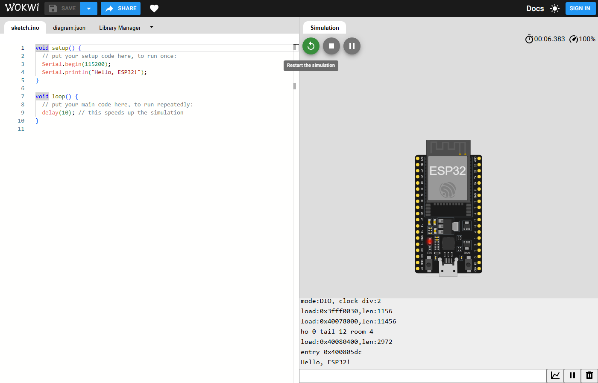
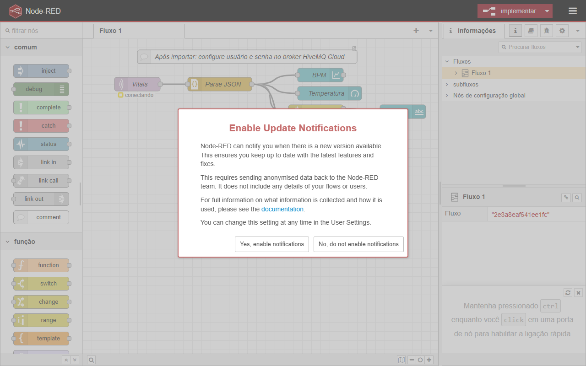

# CardioIA — Fase 3: Monitoramento Contínuo de Saúde com IoT

## Visão Geral do Projeto

Protótipo completo: ESP32 (Wokwi) com DHT22 + botão (BPM), SPIFFS com resiliência offline, publicação segura em MQTT (HiveMQ Cloud TLS 8883), dashboard em tempo real (Node‑RED) e automação de alertas (REST + e‑mail). Notebook demonstra detecção de anomalias simples em séries temporais.

## Arquitetura

```mermaid
flowchart TD
  A[ESP32 (Wokwi)\nDHT22 + Botão/BPM\nSPIFFS + Resiliência] -->|TLS 8883 / JSON| B[(HiveMQ Cloud MQTT)]
  B --> C[Node‑RED\nFlow + Dashboard]
  C --> D[UI em tempo real\nGráfico BPM / Gauge Temp / Alertas]
  A -.->|Evidência| E[Flush da fila SPIFFS\napós reconexão]
  F[Cliente REST] --> G[FastAPI /vitals\nRegras de risco]
  G --> H[E‑mail (SMTP)\nSimulado/Real]
```

## Estrutura

```
FASE3/
├── ir-alem/              # REST + e‑mail (IR ALÉM 1)
├── node-red/             # Fluxos (TLS e demo)
├── notebooks/            # Séries temporais (IR ALÉM 2)
├── reports/              # Relatórios + evidências (prints)
├── tools/                # Scripts de teste/captura
└── wokwi/                # ESP32 (Arduino) + diagrama
```

## Como Executar

1) Wokwi (ESP32)
- Crie `FASE3/wokwi/config.h` a partir de `config.example.h` com suas credenciais do HiveMQ Cloud.
- Importe `wokwi/` no Wokwi e clique em “Start the simulation”.
- Link público: https://wokwi.com/projects/445645684122269697

2) Node‑RED
- Importe `node-red/flow-hivemq-cloud.json` e preencha usuário/senha do HiveMQ Cloud.
- Acesse `http://127.0.0.1:1880/ui` para ver o dashboard.

3) REST + e‑mail
- `pip install -r ir-alem/requirements.txt`
- Servidor: `uvicorn ir-alem.rest_alerts:app --reload`
- Cliente: `python ir-alem/client.py`

4) Notebook
- `jupyter notebook` e abra `notebooks/phase3_time_series.ipynb`

## Evidências Visuais

| Wokwi (rodando) | Flush SPIFFS | Dashboard | Fluxo |
|---|---|---|---|
|  |  |  |  |
