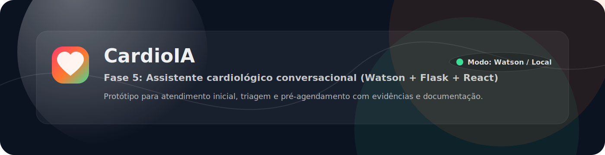
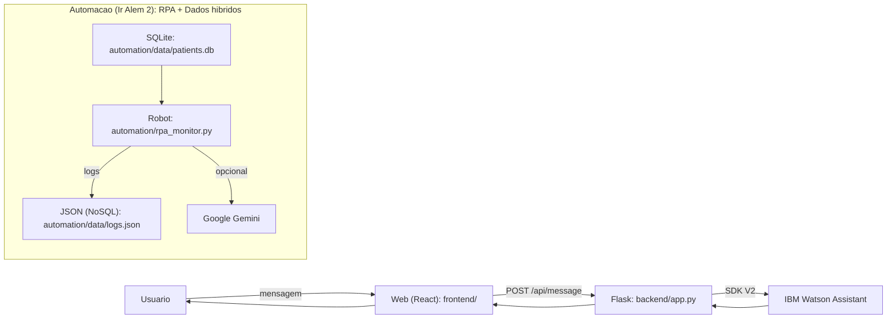
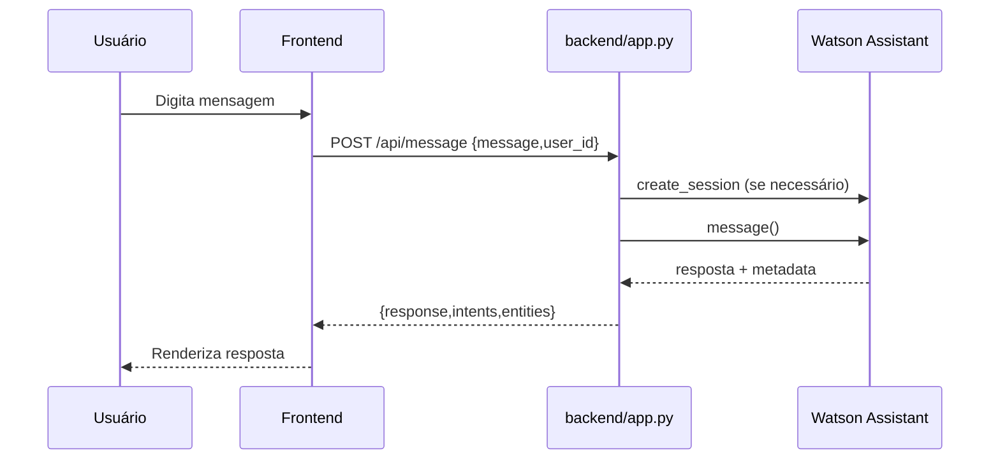
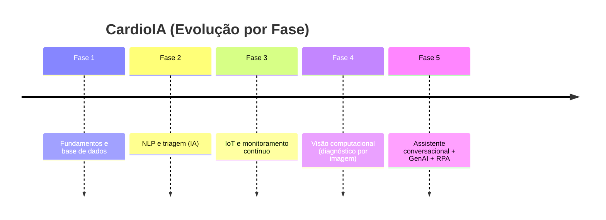

# CardioIA - Fase 5: Assistente Cardiológico Inteligente (Experiência do Paciente)



Entrega acadêmica FIAP (Cap 1) baseada no enunciado em `enunciado-fase5.txt`.

Esta fase evolui o CardioIA para um **assistente conversacional** capaz de interagir em linguagem natural, organizar **informações clínicas** e integrar **NLP + automação + APIs + dados**.

Observação: este é um **protótipo acadêmico** para fins didáticos (FIAP).

## Links Rápidos
- Checklist requisito -> evidência: `document/fase5/checklist_requisitos.md`
- Relatórios (MD + PDF): `document/fase5/README.md`
- Export (evidência) do assistente (modelo clássico): `watson_skill_export.json`
- Mapa do repositório (arquivo por arquivo): `document/fase5/mapa_repositorio.md`

## O Que Foi Entregue (Resumo)
- **Parte 1 (Watson + NLP)**:
  - Modelagem do assistente no Watson Assistant e export (intents/entities/dialog nodes)
  - Integração via backend Flask (API)
  - Relatório curto (1-2 páginas) em `document/fase5/relatorio_conversacional.pdf`
- **Parte 2 (Interface)**:
  - Interface web (React) integrada ao backend
  - Roteiro + campo para link do vídeo: `document/fase5/video_demo.md`
- **Ir Além 1 (GenAI)**:
  - Extração de informações clínicas de texto livre e saída estruturada (JSON) integrada ao protótipo
  - Notebook + documento PDF em `document/fase5/ir-alem-1_extracao_clinica.pdf`
- **Ir Além 2 (RPA + Dados Híbridos)**:
  - Robô que lê dados relacionais (SQLite), detecta anomalias e registra logs em JSON (NoSQL)
  - Documento PDF em `document/fase5/ir-alem-2_rpa_dados_hibridos.pdf`

## O Que Funciona no Protótipo (Na Prática)
- **Conversa (Watson ou Local)**: chat na UI + `POST /api/message`
- **Organizar relato (Ir Além 1)**: UI "Organizar relato" + `POST /api/clinical/extract`
- **Triagem (Fase 2 reaproveitada)**: embutida no "Organizar relato" + `POST /api/phase2/triage`
- **Monitoramento (Ir Além 2 + conceito Fase 3)**: UI "Monitoramento" + `GET /api/monitor/logs` e `POST /api/monitor/run_once`
- **Imagem (Fase 4, opcional)**: UI "Imagem (Fase 4)" + `GET /api/phase4/health`

## Requisitos do Enunciado (Parte 1 e Parte 2)
Checklist completo: `document/fase5/checklist_requisitos.md`.

Parte 1 (Watson + NLP):
- Assistente conversacional usando IBM Watson Assistant: `backend/watson_service.py` + evidência `document/fase5/evidencias/watson_smoke_test.json`
- Modelagem (intents/entities/dialog nodes) como entregável acadêmico: `watson_skill_export.json`
- Fluxo coerente + fallback + exceções básicas: `watson_skill_export.json` + `backend/app.py` + `backend/mock_assistant.py`
- Integração via API (Flask): `backend/app.py` (`POST /api/message`)
- Relatório curto (1-2 páginas): `document/fase5/relatorio_conversacional.pdf`

Parte 2 (Interface):
- Interface web integrada ao backend: `frontend/` (build em `backend/static/`)
- Enviar mensagens e visualizar respostas: UI + `POST /api/message`
- Organização do projeto (boas práticas + estrutura): `document/fase5/mapa_repositorio.md`

## Modos de Execução (Por que existe “LOCAL”)
Para a banca conseguir testar sem depender de credenciais, o sistema roda em 2 modos:
- **WATSON**: usa o assistente publicado no IBM Watson Assistant (API V2).
- **LOCAL (offline)**: simula o fluxo conversacional usando `watson_skill_export.json` (intents/entities/dialog nodes) via `backend/mock_assistant.py`.

No vídeo, a recomendação é mostrar os dois: primeiro WATSON (publicado), depois LOCAL (fallback).

## Arquitetura (Fase 5)

### Visão Geral


### Sequência (Chat)


## Estrutura do Repositório (Entrega Atual)
- `frontend/`: interface web (React + Vite)
- `backend/`: Flask + integração Watson + modo local (offline)
- `automation/`: RPA + SQLite + logs JSON
- `notebooks/`: notebook de GenAI (Ir Além 1)
- `document/fase5/`: relatórios exigidos (MD + PDF) + checklist
- `FASES ANTERIORES/`: histórico das fases anteriores
- `.env`: arquivo local (não versionado) com credenciais

## Tech Stack
- Python 3.10+ (recomendado)
- Flask
- React + Vite (frontend)
- IBM Watson Assistant SDK (`ibm-watson`)
- Google Gemini SDK (`google-generativeai`)
- SQLite (banco relacional, via `sqlite3`)
- JSON file (logs NoSQL)

## Configuração (.env)
Crie `.env` na raiz do repositório a partir de `.env.example`.

Variáveis:
- `WATSON_API_KEY`: API key das Service Credentials
- `WATSON_URL`: URL da instância (normalmente `.../instances/<id>`)
- `WATSON_ASSISTANT_ID`: ID do Assistant publicado
- `WATSON_ENVIRONMENT_ID`: Environment ID (GUID).
  - Onde pegar: no Watson Assistant, abra o seu assistant -> **Environments** -> selecione **Live** (ou Draft) -> copie o **Environment ID**.
- `ASSISTANT_ID`: compatibilidade (opcional). Se preenchido, o backend usa esse valor como assistant/environment quando você não quiser separar as variáveis.
- `GEMINI_API_KEY`: chave do Gemini (opcional)
- `GEMINI_MODEL`: opcional (o backend tenta alguns nomes comuns e faz fallback para extração local)
- `CARDIOIA_ASSISTANT_MODE`: `watson` (padrão) ou `local` (offline)
- `WATSON_CONSOLE_URL`: opcional (aparece no botão “Watson IBM” da UI para abrir o seu projeto no console)
- `PHASE3_ALERTS_URL`: opcional (se você subir o serviço de alertas da Fase 3, a Fase 5 consegue chamá-lo)
- `PHASE4_CV_URL`: opcional (se você subir o serviço da Fase 4, a Fase 5 detecta via `/health`)

## Como Rodar

### 1. Backend + Frontend (Chat)
```powershell
pip install -r backend/requirements.txt
python run_server.py
```
Abra: `http://127.0.0.1:5000`

Na interface, use as abas:
- **Conversa** (Parte 1 e Parte 2)
- **Organizar relato** (Ir Além 1 + Fase 2)
- **Monitoramento** (Ir Além 2 + conceito Fase 3)
- **Imagem (Fase 4)** (opcional)

Opcional (para editar o frontend):
```powershell
cd frontend
npm install
npm run dev
```

### 2. Modo Local (Offline, sem credenciais)
```powershell
$env:CARDIOIA_ASSISTANT_MODE="local"
python run_server.py
```

### 3. Automação RPA (Ir Além 2)
```powershell
cd automation
python database_setup.py
python rpa_monitor.py
```
Saída:
- `automation/data/patients.db`
- `automation/data/logs.json`

### 4. Notebook GenAI (Ir Além 1)
```powershell
jupyter notebook notebooks/genai_extraction.ipynb
```

## Testes
```powershell
python -m pytest
```

## Como Atendemos o Enunciado (Ponto a Ponto)
Consulte:
- `document/fase5/checklist_requisitos.md`

## Evolução do CardioIA (Fases 2, 3 e 4 -> Fase 5)
Esta entrega é uma **evolução** das fases anteriores: a Fase 5 consolida a “porta de entrada” do paciente (conversa + triagem + encaminhamento) e passa a **usar** módulos/conceitos anteriores como parte do fluxo do protótipo.

- **Fase 2 (NLP + triagem / risco)**  
  Reuso direto no backend (triagem do texto do paciente): `backend/phase2_triage.py` chamando `FASES ANTERIORES/Fase2/src/diagnose.py`.
- **Fase 3 (IoT + monitoramento contínuo)**  
  Regra de alerta (bpm/temp) reaproveitada e exposta em `POST /api/phase3/vitals` (ver `backend/phase3_vitals.py`).
- **Fase 4 (Visão computacional)**  
  Integração opcional como serviço externo (health-check em `GET /api/phase4/health`).

Mapa detalhado (arquivo por arquivo): `document/fase5/mapa_repositorio.md`.

## Fases Anteriores (Histórico)
As fases anteriores estão organizadas em `FASES ANTERIORES/` para manter histórico e rastreabilidade.



## Equipe
Grupo 15 (FIAP):

| Integrante | Contato |
| --- | --- |
| Caio Rodrigues Castro | caiorcastro@gmail.com |
| Felipe Soares Nascimento | consultor.casteliano@gmail.com |
| Fernando Miranda Segregio | segregio@gmail.com |
| Mario Roberto Silva de Almeida | marioalmeida1980@gmail.com |
| Wellington Nascimento de Brito | well334@hotmail.com |

Detalhes de colaboração e convenções: `CONTRIBUTORS.md`.

## Evidências do Watson “vivo” (para a banca)
Mesmo com limitações de alguns planos/contas no Watson (endpoints administrativos podem retornar 404), a evidência principal é a conversa real via API:
- Script (gera evidência sem segredos): `scripts/watson_generate_evidence.py`
- Resultado: `document/fase5/evidencias/watson_smoke_test.json`
- Explicação do espelhamento (Watson vivo x export clássico): `document/fase5/evidencias/espelhamento_watson.md`

## Documentação no navegador (para o vídeo)
O backend também serve documentação local para facilitar a demonstração:
- `/docs/fase5/...` (ex: `/docs/fase5/relatorio_conversacional.pdf`)
- `/docs/anteriores/...` (ex: `/docs/anteriores/REPORT-DE-AVAN%C3%87O.MD`)
- `/docs/root/...` (ex: `/docs/root/CONTRIBUTORS.md`)
