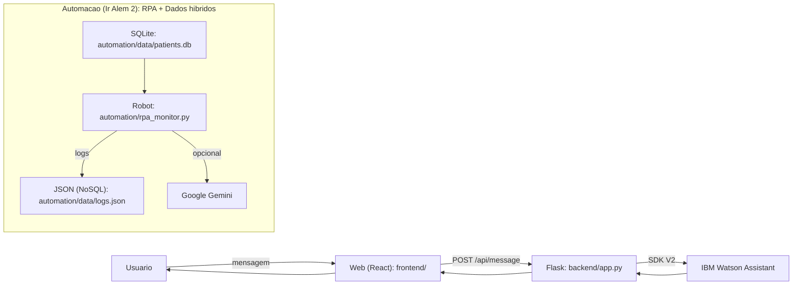
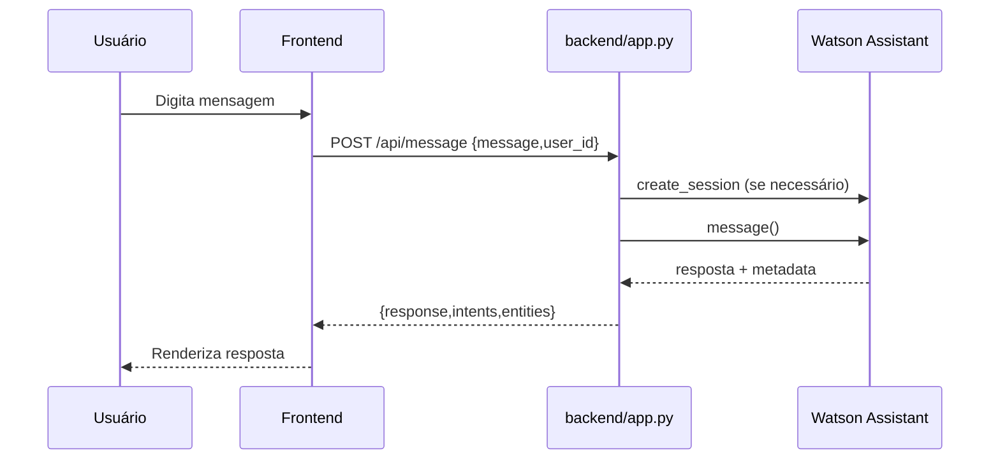
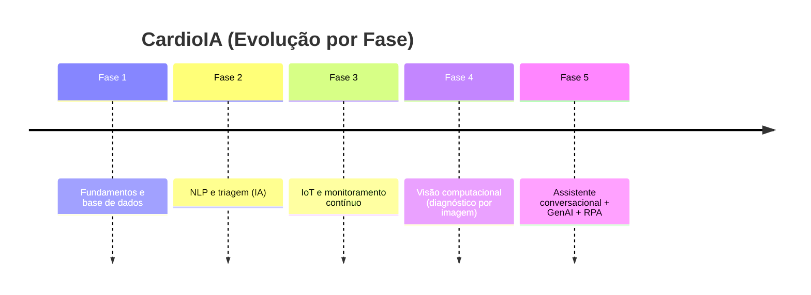

<p align="center">
  <a href="https://www.fiap.com.br/">
    
  </a>
</p>
<p align="center">
  <strong>FIAP - Faculdade de Informática e Administração Paulista</strong><br/>
  <a href="https://www.fiap.com.br/">fiap.com.br</a>
</p>

# CardioIA - Fase 5: Assistente Cardiológico Inteligente (Experiência do Paciente)


Protótipo conversacional capaz de interagir em linguagem natural, organizar informações clínicas e integrar NLP + automação + APIs + dados.

<p align="center">
  
  
  
  
  
  
  
  
  
  
</p>

## Visão Geral
O CardioIA (Fase 5) concentra a experiência do paciente em um único fluxo:
- conversa (Watson ou Local)
- triagem e organização de relato clínico (com saída estruturada em JSON)
- monitoramento com automação (RPA) e rastreabilidade por logs
- ponto de extensão para serviço de análise por imagem (opcional)

## Equipe
Grupo 15 (FIAP):

| Integrante | Contato |
| --- | --- |
| Caio Rodrigues Castro | caiorcastro@gmail.com |
| Felipe Soares Nascimento | consultor.casteliano@gmail.com |
| Fernando Miranda Segregio | segregio@gmail.com |
| Mario Roberto Silva de Almeida | marioalmeida1980@gmail.com |
| Wellington Nascimento de Brito | well334@hotmail.com |

Detalhes de colaboração e convenções: `CONTRIBUTORS.md`.

## O Que o Protótipo Faz
- **Atendimento inicial por conversa**: acolhe, identifica intenção e conduz um fluxo simples (ex.: saudação, agendamento, sinais de alerta).
- **Organização de informações clínicas**: a partir do relato do usuário, gera uma saída estruturada (JSON) e um resumo legível.
- **Monitoramento e rastreabilidade**: simula um robô (RPA) que lê dados estruturados, detecta anomalias e registra eventos em logs.
- **Extensões do projeto**:
  - triagem reaproveitando a lógica da Fase 2
  - avaliação de vitais seguindo a regra da Fase 3
  - health-check de um serviço de imagem (Fase 4), quando disponível

## API (Rotas Principais)
| Recurso | Método | Rota |
| --- | --- | --- |
| Conversa | POST | `/api/message` |
| Triagem (Fase 2) | POST | `/api/phase2/triage` |
| Organizar relato (GenAI + fallback) | POST | `/api/clinical/extract` |
| Monitoramento (logs) | GET | `/api/monitor/logs` |
| Monitoramento (rodar 1 ciclo) | POST | `/api/monitor/run_once` |
| Vitals (conceito Fase 3) | POST | `/api/phase3/vitals` |
| Imagem (Fase 4, opcional) | GET | `/api/phase4/health` |

## Modos de Execução
O sistema roda em 2 modos:
- **WATSON**: usa o assistente publicado no IBM Watson Assistant (API V2).
- **LOCAL (offline)**: simula o fluxo conversacional usando `watson_skill_export.json` (intents/entities/dialog nodes) via `backend/mock_assistant.py`.

## Arquitetura (Fase 5)

### Visão Geral


### Sequência (Chat)


## Estrutura do Repositório
- `frontend/`: interface web (React + Vite)
- `backend/`: Flask + integração Watson + modo local (offline)
- `automation/`: RPA + SQLite + logs JSON
- `notebooks/`: notebook de GenAI (Ir Além 1)
- `document/fase5/`: documentação e relatórios (MD + PDF)
- `FASES ANTERIORES/`: histórico das fases anteriores
- `.env`: arquivo local (não versionado) com credenciais

## Tech Stack
- Python 3.10+ (recomendado)
- Flask
- React + Vite (frontend)
- IBM Watson Assistant SDK (`ibm-watson`)
- Google Gemini SDK (`google-generativeai`)
- SQLite (banco relacional, via `sqlite3`)
- JSON file (logs NoSQL)

## Configuração (.env)
Crie `.env` na raiz do repositório a partir de `.env.example`.

Variáveis:
- `WATSON_API_KEY`: API key das Service Credentials
- `WATSON_URL`: URL da instância (normalmente `.../instances/<id>`)
- `WATSON_ASSISTANT_ID`: ID do Assistant publicado
- `WATSON_ENVIRONMENT_ID`: Environment ID (GUID).
  - Onde pegar: no Watson Assistant, abra o seu assistant -> **Environments** -> selecione **Live** (ou Draft) -> copie o **Environment ID**.
- `ASSISTANT_ID`: compatibilidade (opcional). Se preenchido, o backend usa esse valor como assistant/environment quando você não quiser separar as variáveis.
- `GEMINI_API_KEY`: chave do Gemini (opcional)
- `GEMINI_MODEL`: opcional (o backend tenta alguns nomes comuns e faz fallback para extração local)
- `CARDIOIA_ASSISTANT_MODE`: `watson` (padrão) ou `local` (offline)
- `WATSON_CONSOLE_URL`: opcional (aparece no botão “Watson IBM” da UI para abrir o seu projeto no console)
- `PHASE3_ALERTS_URL`: opcional (se você subir o serviço de alertas da Fase 3, a Fase 5 consegue chamá-lo)
- `PHASE4_CV_URL`: opcional (se você subir o serviço da Fase 4, a Fase 5 detecta via `/health`)

## Como Rodar

### 1. Backend + Frontend (Chat)
```powershell
# Na raiz do repositório:
pip install -r backend/requirements.txt
python run_server.py
```
Abra: `http://127.0.0.1:5000`

Se você estiver dentro da pasta `backend/`, use:
```powershell
pip install -r requirements.txt
python ..\\run_server.py
```

Na interface, use as abas:
- **Conversa**
- **Organizar relato**
- **Monitoramento**
- **Imagem (Fase 4)** (opcional)

Opcional (para editar o frontend):
```powershell
cd frontend
npm install
npm run dev
```

### 2. Modo Local (Offline, sem credenciais)
```powershell
$env:CARDIOIA_ASSISTANT_MODE="local"
python run_server.py
```

### 3. Automação RPA (Ir Além 2)
```powershell
cd automation
python database_setup.py
python rpa_monitor.py
```
Saída:
- `automation/data/patients.db`
- `automation/data/logs.json`

### 4. Notebook GenAI (Ir Além 1)
```powershell
jupyter notebook notebooks/genai_extraction.ipynb
```

## Testes
```powershell
python -m pytest
```

## Documentação
- Checklist: `document/fase5/checklist_requisitos.md`
- Relatórios (MD + PDF): `document/fase5/README.md`
- Relatório curto (1-2 páginas): `document/fase5/relatorio_conversacional.pdf`
- Export do assistente (modelo clássico): `watson_skill_export.json`
- Mapa do repositório (arquivo por arquivo): `document/fase5/mapa_repositorio.md`

## Watson (Integração Publicada) e Evidências Técnicas
- Smoke test (sem segredos): `document/fase5/evidencias/watson_smoke_test.json`
- Script que gera o smoke test: `scripts/watson_generate_evidence.py`
- Espelhamento (Watson Actions vs export clássico): `document/fase5/evidencias/espelhamento_watson.md`

## Documentos via navegador
O backend também serve documentação local:
- `/docs/fase5/...` (ex: `/docs/fase5/relatorio_conversacional.pdf`)
- `/docs/anteriores/...` (ex: `/docs/anteriores/REPORT-DE-AVAN%C3%87O.MD`)
- `/docs/root/...` (ex: `/docs/root/CONTRIBUTORS.md`)

## Apêndice: Evolução e Fases Anteriores
A Fase 5 consolida a “porta de entrada” do paciente (conversa + triagem + encaminhamento) e reaproveita módulos/conceitos anteriores como parte do fluxo do protótipo.

- **Fase 2 (NLP + triagem / risco)**  
  Reuso direto no backend (triagem do texto do paciente): `backend/phase2_triage.py` chamando `FASES ANTERIORES/Fase2/src/diagnose.py`.
- **Fase 3 (IoT + monitoramento contínuo)**  
  Regra de alerta (bpm/temp) reaproveitada e exposta em `POST /api/phase3/vitals` (ver `backend/phase3_vitals.py`).
- **Fase 4 (Visão computacional)**  
  Integração opcional como serviço externo (health-check em `GET /api/phase4/health`).

Histórico completo:
- `FASES ANTERIORES/`



---

<p align="center">
  <strong>CardioIA (Fase 5)</strong><br/>
  <a href="document/fase5/README.md">documentação</a> •
  <a href="document/fase5/checklist_requisitos.md">checklist</a> •
  <a href="watson_skill_export.json">export do assistente</a> •
  <a href="CONTRIBUTORS.md">colaboradores</a>
</p>
